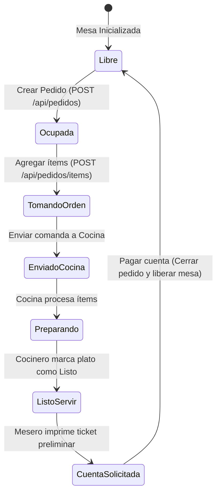

# 🍽️ Módulo 3: Mesas y Pedidos

### 1. Descripción Funcional
Administra la distribución física y el estado de ocupación del salón. Los meseros pueden abrir mesas virtuales, añadir productos solicitados por los clientes en tiempo real, enviar comandas directamente a la cocina, mover consumos entre mesas y realizar cierres parciales de cuentas.

---

### 2. Componentes del Código
* **Controlador:** [MesasController.js](file:///c:/laragon/www/Sistema-Restaurante-Node/app/Http/Controllers/Tenant/Mesas/MesasController.js)
* **Servicio:** [MesaService.js](file:///c:/laragon/www/Sistema-Restaurante-Node/services/Tenant/Mesas/MesaService.js)
* **Repositorio:** [MesaRepository.js](file:///c:/laragon/www/Sistema-Restaurante-Node/repositories/Tenant/MesaRepository.js)
* **Ruta de Acceso:** `/mesas`

---

### 3. Tablas de Base de Datos Relacionadas
* `mesas`: mesas físicas (`qr_token` para el Menú QR) y virtuales (domicilios). Número, capacidad, ubicación, estado.
* `pedidos`: cabecera (mesa, usuario, total, `estado`: `abierto`/`cerrado`/`cancelado`, `origen`: `mesero`/`qr`/`caja`, `propina`).
* `pedido_items`: platos del pedido con cantidad, precio, `estado` de cocina, **`nota` por ítem** y `modificadores_hash`. También `pagado`/`forma_pago` para el pago por producto (cuentas separadas).
* `pedido_item_modificadores`: toppings elegidos por ítem (ver módulo 12). En el carrito de Mesas se muestran los toppings y la nota bajo el nombre del producto.
* `pedido_abonos`: abonos libres a la cuenta — pagos parciales que NO se ligan a ningún producto (ver sección 5).
* Los pedidos creados desde el **Menú QR** (`origen = 'qr'`) aparecen en esta misma pantalla para que el mesero los valide y envíe a cocina.

---

### 5. Pagos parciales: por producto vs. abono libre
Hay dos formas de registrar que la mesa ya pagó una parte de la cuenta **antes** de facturarla completa, pensadas para que la caja no se descuadre cuando una mesa paga en momentos distintos con métodos distintos:

* **Pago por producto** (`btnFacturarPedido` → "Por Producto", o el pago individual de un ítem): el cajero selecciona productos/cantidades concretas y les asigna una forma de pago. Sirve cuando el monto recibido coincide con productos puntuales.
* **Abono libre** (`btnAbonarPedido`, servicio `AbonoPedidoService`): un monto suelto contra el total del pedido, sin ligarlo a ningún producto — para el caso típico "me dan 15.000 en efectivo, el resto lo pasan por transferencia luego". No puede superar el saldo pendiente de productos (la propina queda fuera: siempre se cobra completa al cerrar la mesa, nunca por adelantado).

En ambos casos, al facturar la mesa completa (`FacturarPedidoService`) todo se suma: lo ya pagado por ítem + los abonos + lo que falte con la forma de pago elegida al cerrar. Si el resultado mezcla efectivo y transferencia, la factura queda automáticamente con `forma_pago = 'mixto'` y sus montos reales (`monto_efectivo`/`monto_transferencia`), que es lo que después lee el módulo de Caja para calcular el efectivo esperado.

---

### 4. Diagrama de Estado del Pedido y Mesa

