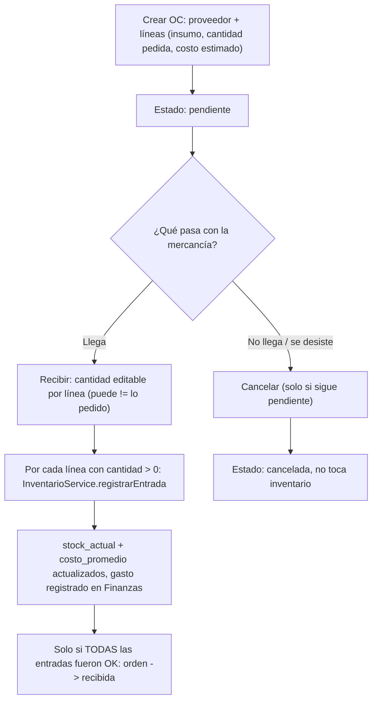

# 📦 Módulo 14: Órdenes de Compra a Proveedor

### 1. Descripción Funcional
Cierra el ciclo que faltaba entre **Proveedores** (módulo 043, CRUD + facturas archivadas) e **Inventario**: crear una orden de compra (qué se pide, a qué proveedor, cuánto cuesta estimado), y al **recibirla**, registrar la cantidad que realmente llegó — que puede ser distinta a lo pedido — como entrada de inventario. Antes, la única forma de subir stock por compra era el formulario genérico de "movimiento de entrada", sin quedar ligado a una orden ni a un pedido previo.

---

### 2. Componentes del Código
* **Controlador:** [OrdenesCompraController.js](file:///c:/laragon/www/Sistema-Restaurante-Node/app/Http/Controllers/Tenant/OrdenesCompraController.js)
* **Servicio:** [OrdenCompraService.js](file:///c:/laragon/www/Sistema-Restaurante-Node/services/Tenant/OrdenCompraService.js) — valida proveedor/insumos del tenant y orquesta la recepción.
* **Repositorio:** [OrdenCompraRepository.js](file:///c:/laragon/www/Sistema-Restaurante-Node/repositories/Tenant/OrdenCompraRepository.js)
* **Enganche con inventario:** `InventarioService.registrarEntrada(tenantId, { insumo_id, cantidad, costo_unitario, proveedor_id, documento_referencia })` — ya existía (soporta `proveedor_id`/`documento_referencia` desde el módulo 043) y es el único punto que toca stock/costo promedio.
* **Rutas:** `/ordenes-compra` (vista) · `GET|POST /ordenes-compra` · `GET /ordenes-compra/:id` · `PUT /ordenes-compra/:id/recibir` · `PUT /ordenes-compra/:id/cancelar`
* **Permisos:** `proveedores.ordenes` (admin/superadmin por defecto; requiere también el feature de plan `inventario`).

---

### 3. Tablas de Base de Datos Relacionadas
* `ordenes_compra`: `proveedor_id`, `estado` (`pendiente`/`recibida`/`cancelada`), `notas`, `fecha_recepcion`.
* `orden_compra_items`: `insumo_id`, `cantidad_pedida`, `costo_unitario_estimado`, `cantidad_recibida` (`NULL` hasta que se recibe).
* `movimientos_inventario`: cada línea recibida genera un `tipo='entrada'` con `proveedor_id` y `documento_referencia = 'OC-{id}'` (mismas columnas que ya traía el módulo de proveedores, ahora con un emisor real).

---

### 4. Diagrama del Flujo

---

### 5. Notas de implementación
* La recepción es **atómica en el sentido de orden de operaciones**: primero se registran las entradas de inventario (cada una transaccional por su cuenta en `InventarioService`) y solo si todas salen bien se marca la orden como `recibida`. Si una falla, la orden queda `pendiente` para reintentar — nunca queda "recibida" sin que el stock se haya movido.
* Recibir es una operación única por orden (no hay recepciones parciales en el tiempo): se captura la cantidad real de cada línea en una sola pantalla y se cierra.
* El costo unitario que se lleva a `registrarEntrada` es el `costo_unitario_estimado` capturado al crear la OC (el mismo que ya usa `InventarioService.calcularCostoEntrada` como fallback si no se pasa uno).
* `proveedor_facturas` (módulo 043/047, archivo de la factura del proveedor) es un flujo aparte — sigue sirviendo para archivar el PDF/imagen de la factura, sin relación estructural con la OC.
