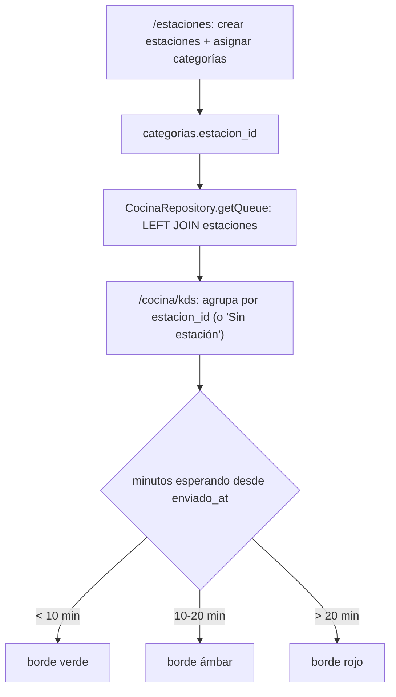

# 🖥️ Módulo 15: KDS por Estación

### 1. Descripción Funcional
Segunda vista sobre la misma cola de cocina (módulo 5), agrupada por **estación** (ej. Fría, Caliente, Bebidas) en vez de por mesa — el formato clásico de un Kitchen Display System: una columna por estación, con las comandas pendientes de esa estación y una alerta visual cuando llevan esperando demasiado. Cada restaurante define sus propias estaciones (nombre y orden) y asigna cada categoría de producto a una de ellas desde `/estaciones`.

---

### 2. Componentes del Código
* **Estaciones (CRUD + asignación):**
  * Controlador: [EstacionesController.js](file:///c:/laragon/www/Sistema-Restaurante-Node/app/Http/Controllers/Tenant/EstacionesController.js)
  * Servicio: [EstacionService.js](file:///c:/laragon/www/Sistema-Restaurante-Node/services/Tenant/EstacionService.js)
  * Repositorio: [EstacionRepository.js](file:///c:/laragon/www/Sistema-Restaurante-Node/repositories/Tenant/EstacionRepository.js)
  * Rutas: `/estaciones` (vista + `GET|POST|PUT|DELETE`) · `PUT /estaciones/categorias/:categoriaId` (asignar/quitar estación)
  * Permiso: `cocina.gestionar` (ya existía en el catálogo de permisos desde el módulo base, sin ninguna ruta que lo exigiera todavía).
* **Vista KDS:** `GET /cocina/kds` en el mismo [CocinaController.js](file:///c:/laragon/www/Sistema-Restaurante-Node/app/Http/Controllers/Tenant/CocinaController.js) del módulo 5 (método `kds`) — solo renderiza la lista de estaciones activas; los datos de la cola los trae el frontend igual que la vista por mesa, vía `GET /api/cocina/cola`.
* **Extensión de la cola:** `CocinaRepository.getQueue` ahora hace `LEFT JOIN estaciones e ON e.id = c.estacion_id` y agrega `estacion_id`/`estacion_nombre`/`estacion_orden` a cada ítem — sin tocar ninguno de los otros consumidores de esa query (siguen ignorando las columnas nuevas).
* **Tiempo real:** reusa el mismo SSE que la vista por mesa (`/api/notifications/subscribe`, evento `orderCreated`) — no hay backend nuevo de tiempo real, solo un agrupamiento distinto del lado del cliente (`public/js/modulos/cocina_kds.js`).

---

### 3. Tablas de Base de Datos Relacionadas
* `estaciones`: `nombre`, `orden`, `activa` — por tenant.
* `categorias.estacion_id` (nullable, `ON DELETE SET NULL`): a qué estación pertenece esa categoría de producto. Una categoría sin asignar cae en el balde "Sin estación" del KDS.

> No existe una pantalla de edición de categorías de producto (se crean al vuelo desde el formulario de productos), así que la asignación categoría → estación se hace desde `/estaciones`, no desde el módulo de productos.

---

### 4. Diagrama del Flujo

---

### 5. Notas de implementación
* Al aplicar la migración se crean 3 estaciones por defecto (Fría, Caliente, Bebidas) por cada tenant activo, para que el KDS no arranque vacío — quedan sin categorías asignadas hasta que el tenant las mapee.
* Los umbrales de espera (10 / 20 minutos) están fijos en `public/js/modulos/cocina_kds.js` en esta primera vuelta; no son configurables por tenant todavía.
* Borrar una estación no está bloqueado aunque tenga categorías asignadas: esas categorías simplemente quedan sin estación (`ON DELETE SET NULL`), consistente con cómo se maneja `insumos.proveedor_id` al borrar un proveedor.
