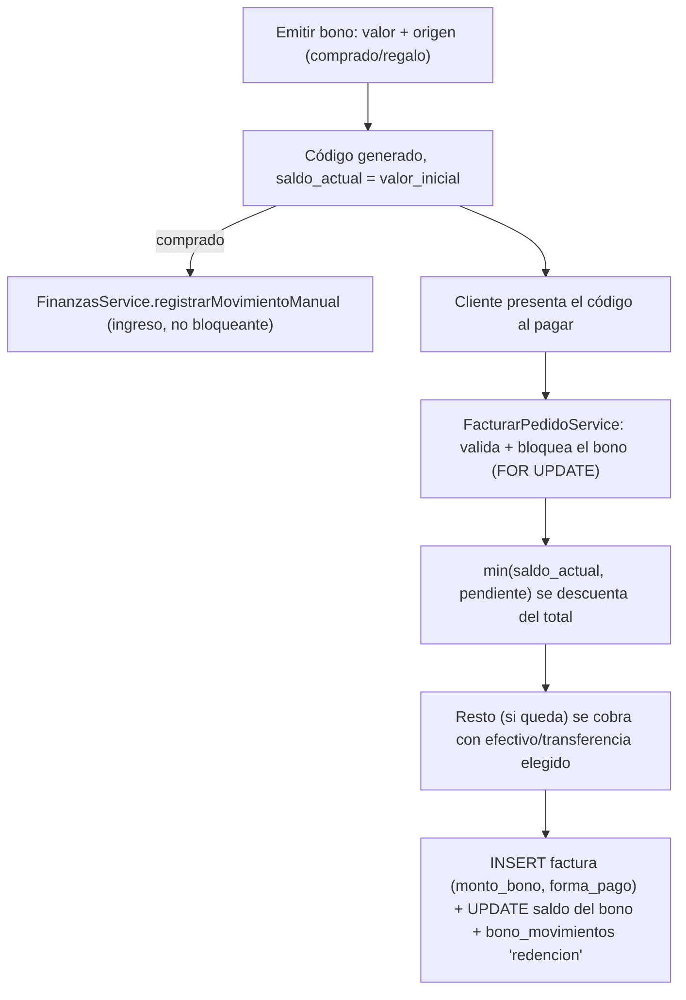

# 🎁 Módulo 16: Bonos Redimibles

### 1. Descripción Funcional
Saldo prepago (el cliente lo compra) o regalado (fidelización), identificado por un **código** (no ligado obligatoriamente a un cliente registrado). Se redime al facturar una mesa: el cajero digita el código en el modal de pago y su saldo se descuenta del total, componiéndose con efectivo/transferencia igual que ya hacen los [abonos libres](03_mesas_pedidos.md) — la factura puede quedar `mixto` (bono + efectivo/transferencia) o `bono` (si el saldo cubre todo).

No hay permiso para redimir: cualquiera que pueda facturar (`/mesas`) puede aplicar un bono. Solo emitir/anular un bono nuevo requiere permiso (`bonos.gestionar`).

---

### 2. Componentes del Código
* **Controlador:** [BonosController.js](file:///c:/laragon/www/Gastroflow/app/Http/Controllers/Tenant/BonosController.js)
* **Servicio:** [BonoService.js](file:///c:/laragon/www/Gastroflow/services/Tenant/BonoService.js) — genera el código, valida y bloquea (`FOR UPDATE`) el bono antes de redimirlo.
* **Repositorio:** [BonoRepository.js](file:///c:/laragon/www/Gastroflow/repositories/Tenant/BonoRepository.js)
* **Redención:** vive dentro de `FacturarPedidoService.execute` (mismo archivo que ya compone abonos libres), dentro de la misma transacción que crea la factura — si la factura falla, el rollback también deshace el descuento del saldo del bono.
* **Rutas:** `/bonos` (vista + `GET|POST`) · `GET /bonos/:id` (detalle+movimientos) · `PUT /bonos/:id/anular` · `GET /api/bonos/validar/:codigo` (preview de saldo desde el checkout, sin permiso de gestión).
* **Permisos:** `bonos.ver` / `bonos.gestionar` (admin/superadmin por defecto). **Sin plan feature** — disponible en todos los planes, igual que Finanzas o Caja.

---

### 3. Tablas de Base de Datos Relacionadas
* `bonos`: `codigo` (único por tenant), `origen` (`comprado`/`regalo`), `valor_inicial`, `saldo_actual`, `cliente_id` (opcional), `estado` (`activo`/`agotado`/`vencido`/`anulado`), `fecha_vencimiento`.
* `bono_movimientos`: traza cada `emision`/`redencion`/`anulacion`, con `factura_id` cuando aplica — es la fuente del historial que se muestra en el detalle de factura (ver [`FacturaRepository.getDetailsForAPI`](file:///c:/laragon/www/Gastroflow/repositories/Tenant/FacturaRepository.js)).
* `facturas.monto_bono` + `forma_pago` ahora acepta también `'bono'` (además de `efectivo`/`transferencia`/`mixto`).

---

### 4. Diagrama del Flujo

---

### 5. Notas de implementación
* **`comprado` vs `regalo`** importa para Finanzas: un bono comprado ya generó un ingreso real al **emitirse** (no al redimirse — redimirlo después es cambiar ese saldo por productos, no una venta nueva). Uno regalado nunca genera ingreso — al redimirse actúa como descuento puro.
* El bono se **bloquea con `FOR UPDATE`** dentro de la misma transacción de la factura, para que dos facturas simultáneas no puedan gastar el mismo saldo dos veces.
* El código usa el alfabeto `ABCDEFGHJKLMNPQRSTUVWXYZ23456789` (sin `0/O` ni `1/I/L`) para evitar ambigüedad al leerlo o escribirlo a mano.
* Un cron diario (`BonoService.marcarVencidos`, aprovechando `node-cron` como ya hace Wompi/alertas) marca `vencido` los bonos activos con saldo cuya fecha límite ya pasó — la validación al redimir también revisa la fecha directamente por si el cron aún no corrió ese día.
* **Alcance de esta primera versión:** la redención solo está integrada en el flujo de Mesas (`/mesas` → facturar). El checkout de POS (`POST /pos/vender`) usa un servicio de facturación distinto (`FacturaService.create`, no `FacturarPedidoService`) y todavía no soporta redimir bonos — queda como siguiente paso si se necesita en el mostrador.
