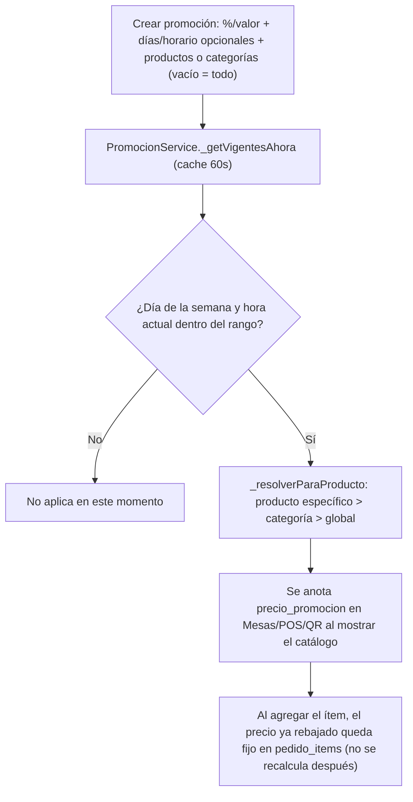

# 🏷️ Módulo 17: Promociones

### 1. Descripción Funcional
Descuento automático (% o $) por día de la semana y/o franja horaria, sobre productos puntuales, una categoría completa, o **todo el catálogo** si no se le asigna ningún producto ni categoría (el caso "todos los productos con descuento un día"). Se aplica solo, sin que el mesero/cajero tenga que activarlo, y se ve en el buscador y favoritos de Mesas, la grilla del POS, y el Menú QR — el mismo precio rebajado que ve el cliente es el que termina en la factura, porque todos esos puntos resuelven el descuento a través del mismo motor.

No está ligado a ningún plan (disponible en Básico/Pro/Premium por igual), solo a permiso: `promociones.ver`/`promociones.gestionar` (admin/superadmin por defecto).

Fases futuras (no en esta versión): por cantidad (2x1, lleva N paga M) y combos a precio fijo — `promociones.tipo` ya es un ENUM abierto a esos valores por eso, aunque hoy solo exista `'descuento'`.

---

### 2. Componentes del Código
* **Controlador:** [PromocionesController.js](file:///c:/laragon/www/Gastroflow/app/Http/Controllers/Tenant/PromocionesController.js)
* **Servicio (motor de matching):** [PromocionService.js](file:///c:/laragon/www/Gastroflow/services/Tenant/PromocionService.js) — un solo punto (`anotarProductos`/`getDescuentoPorProductos`) resuelve "¿aplica una promo ahora mismo a este producto?", cacheado 60s por tenant (`promociones_vigentes_<tenantId>` en `CacheService`, invalidado en cada crear/editar/eliminar).
* **Repositorio:** [PromocionRepository.js](file:///c:/laragon/www/Gastroflow/repositories/Tenant/PromocionRepository.js)
* **Rutas:** `/promociones` (vista + `GET|POST`) · `GET|PUT|DELETE /promociones/:id`.

#### Dónde se resuelve el precio con descuento (server-side, nunca confiando en el cliente salvo la excepción de Mesas/POS descrita abajo):
| Superficie | Punto exacto |
|---|---|
| Buscador de Mesas | `ProductService.search` → anota antes de responder `/api/productos/buscar` |
| Favoritos de Mesas | `MesaDashboardController.index` → anota la misma lista que arma la grilla de favoritos |
| Grilla del POS | `POSService.getProductosForPOS` → anota antes de responder al frontend |
| Menú QR (ver) | `MenuQRService.getMenuData` → anota antes de agrupar por categoría |
| Menú QR (pedir) | `PedidoQRService.procesarPedido` → **resuelve de nuevo server-side** (no confía en lo que mandó el navegador), igual que ya hace con los toppings |
| Mesas (agregar ítem) | El precio ya rebajado viaja desde el buscador/favoritos hasta `AgregarItemService`, que confía en el precio que manda el mesero (mismo modelo de confianza que ya tenía el descuento manual) |
| POS (cobrar) | El descuento se traduce a un `descuento_porcentaje` de línea al agregar al carrito (`pos_core.js`), reusando el pipeline de descuento manual que POS ya tenía completo (badge, cálculo neto, ticket, payload a `/pos/vender`) |

---

### 3. Tablas de Base de Datos Relacionadas
* `promociones`: `nombre`, `tipo` (`descuento` hoy), `valor_tipo` (`porcentaje`/`valor`), `valor`, `dias_semana` (SET, NULL = todos los días), `hora_inicio`/`hora_fin` (NULL = todo el día), `fecha_inicio`/`fecha_fin` (vigencia opcional), `activa`.
* `promocion_productos` / `promocion_categorias`: alcance (many-to-many). Una promoción sin filas en ninguna de las dos aplica a todo el catálogo.

---

### 4. Diagrama del Flujo

---

### 5. Notas de implementación
* **El precio se fija al agregar el ítem, no se recalcula al facturar** — mismo criterio que ya usa el resto del pricing de la app (modificadores, descuento manual): si una promo se activa o desactiva mientras una mesa ya tiene ítems en la mesa, esos ítems ya agregados NO cambian de precio retroactivamente.
* **Prioridad de alcance**: si un producto cae dentro de una promo específica a él Y de una promo de su categoría (o global) al mismo tiempo, gana siempre la más específica (producto > categoría > global). Si hay dos promociones igual de específicas vigentes a la vez, no hay una regla de desempate explícita más allá del orden de carga — evitar configurar promos solapadas sobre el mismo alcance.
* **Zona horaria**: el día de la semana y la hora "ahora mismo" se calculan con un offset fijo de -05:00 (Colombia no tiene horario de verano), sin depender de `Intl`/locale del servidor — mismo criterio que ya usa el resto del proyecto para fechas Colombia.
* **Alcance de esta primera versión**: el checkout de POS (`POST /pos/vender`) sigue confiando en el precio de línea que manda el frontend (igual que ya confiaba en el descuento manual) — el descuento de la promo viaja ahí como un `descuento_porcentaje` normal, no hay una re-validación server-side del precio base en ese endpoint todavía (sí la hay en Menú QR).
